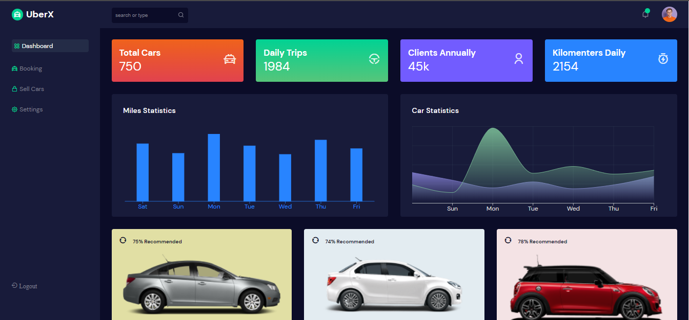

# CAR DASHBOARD

      
 

## Objetivo:

### Foi criar um dashboard com um foco maior no design e interface.

## Descrição:

- `Projeto feito com React JS`
- `Foi utlizado react router dom para gerenciamento de rotas`

## <i>Douglas Monteiro</i> 😁🔥🚀
